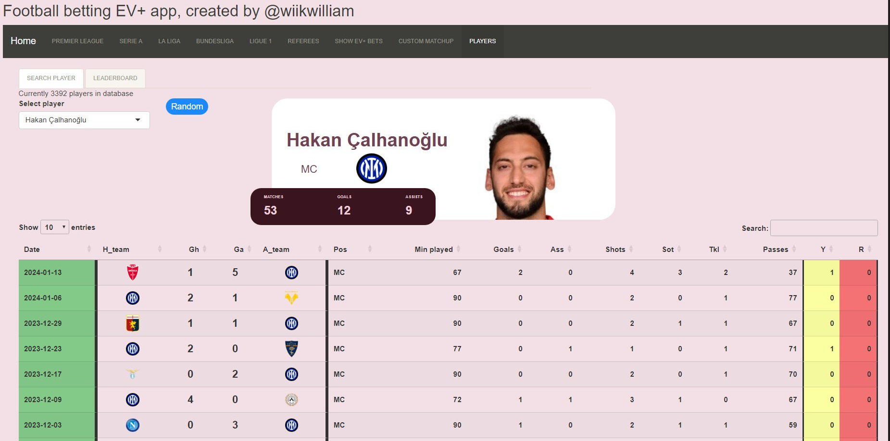

# Football-shiny-app
An R Shiny app was developed to display statistics about football teams and players.

The app includes models for predicting various metrics, such as the number of shots and corners a team might have in a given match.

Additionally, the app generates diagrams that allowed me to explore trends and patterns in the data.

The data was collected from fbref and understat and was then stored in a SQL-database.

